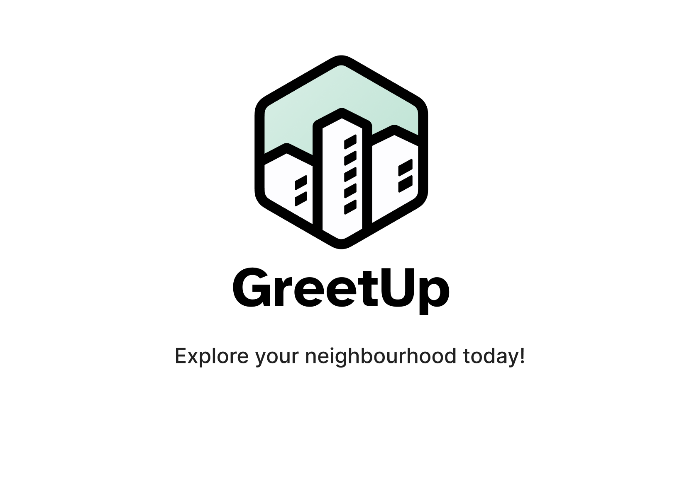

# GreetUp
This was the final project in the course Applikationsutveckling för Internet (Application Development for the Internet) and Teknik för Sociala  Medier (Technology for Social Media) at Umeå University.

This project was made in collaboration with marketing students from Edith Cowan University in Perth, Australia.

The task was to develop a social media platform for ioslated elderly people in Australia. The result was GreetUp, a platform where disabled elderly can view, attend and organize events in their neighborhoods.
